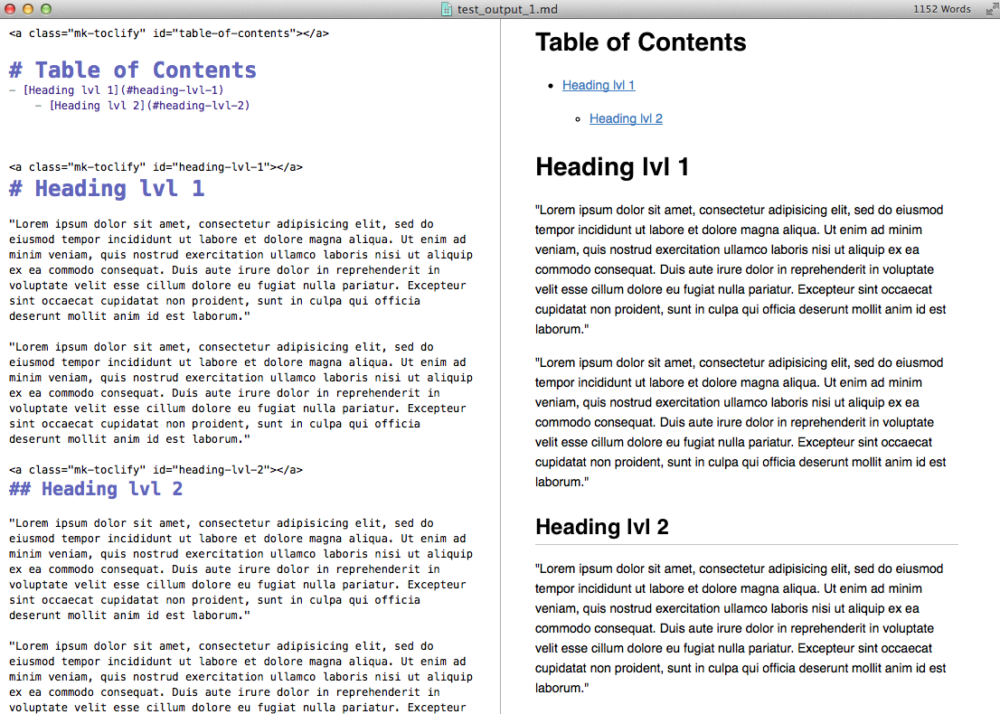
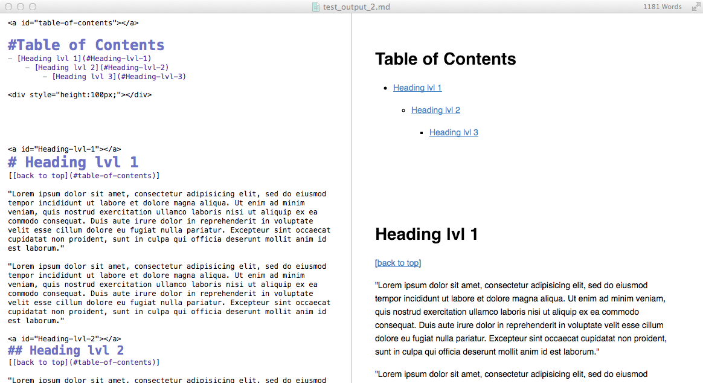
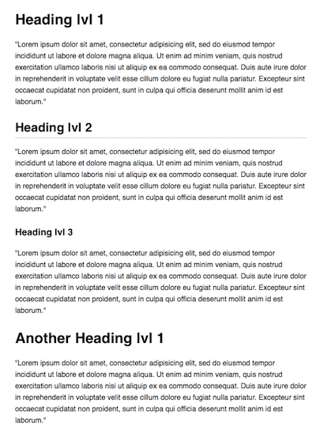
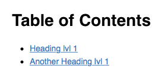
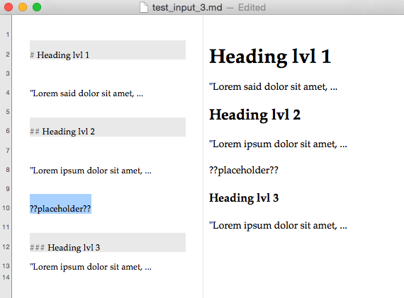
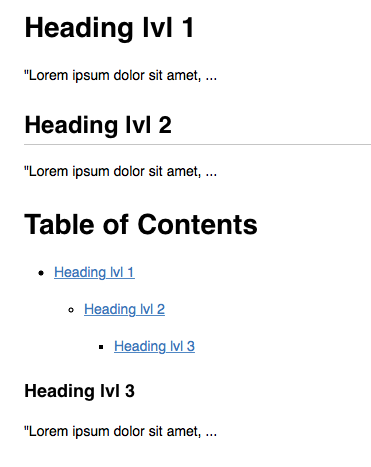

markdown-toclify
================

markdown_toclify.py is a Python command line script that adds a **Table of Contents** with internal section-links to Markdown documents.

This project is hosted at: [https://github.com/rasbt/markdown-toclify](https://github.com/rasbt/markdown-toclify).

**Compatible to [CommonMark](http://standardmarkdown.com) (formerly known as Common Markdown).**

Sebastian Raschka 2014-2015

- [Usage](#usage)
    - [Command line arguments](#command-line-arguments)
    - [Using the Python module](#useing-the-python-module)
- [Examples](#examples)
    - [Basic usage](#basic-usage) 
    	- [Input file](#input-file)
    	- [Simple output file](#simple-output-file)
    - [Advanced options](#advanced-options)
    - [Output file with back-to-top links and vertical space](#output-file-with-back-to-top-links-and-vertical-space)
    - [Heading level exclusion](#output-file-with-back-to-top-links-and-vertical-space)
    - [TOC insertion at a placeholder position](#toc-insertion-at-a-placeholder-position)
  

**Requires:**  

- [Python 2.7.x or 3.x](https://www.python.org/downloads/)
- [argparse](https://pypi.python.org/pypi/argparse)

 

# Usage
[[back to top](#markdown-toclify)]

You can simply copy the stand_alone script [./markdown_toclify/markdown_toclify.py](./markdown_toclify/markdown_toclify.py) to a local directory on your computer and use it from there.

The basic usage is quite simple, you just need to provide a Markdown-formatted input file and the modified Markdown contents will be printed to the standard output screen. 

	./markdown_toclify.py input.md
	
 

## Command line arguments
[[back to top](#markdown-toclify)]

<pre>positional arguments:
  input.md              path to the Markdown input file

optional arguments:
  -h, --help            show this help message and exit
  -o output.md, --output output.md
                        path to the Markdown output file
  -b, --back_to_top     add [back to top] links.
  -g, --github          omits id-anchor tags (recommended for GitHub)
  -s pixels, --spacer pixels
                        add horizontal space (in pixels) after the table of contents
  -n, --nolink          create the table of contents without internal links
  -e EXCLUDE_H, --exclude_h EXCLUDE_H
                        exclude eading levels, e.g., "2,3" to exclude all level 2 and 3 headings
  --placeholder PLACEHOLDER
                        inserts TOC at the placeholder string instead of inserting it on top of the document
  --no_toc_header       suppresses the Table of Contents header
  -v, --version         show program's version number and exit
</pre>

 
 

## Using the Python module
[[back to top](#markdown-toclify)]

Alternatively, markdown_toclify can be installed via pip

	pip install markdown_toclify

and used from the command line as 

	python -m markown_toclify -h

Furthermore, markown_toclify can also be imported as module and be used within Python. For example,

    from markdown_toclify import markdown_toclify
    cont = markdown_toclify(input_file='/Users/sebastian/Desktop/test_input.md')

The markdown_toclify module has the same functionality as the command line tool. For more information about the usage, please refer to the help function via

    help(markdown_toclify)

 
 

#Examples
[[back to top](#markdown-toclify)]

 
 

## Basic usage

 

### Input file
[[back to top](#markdown-toclify)]

 
 

### Simple output file
[[back to top](#markdown-toclify)]

Command:

	./markdown_toclify.py input.md -o output.md

 

 
 

## Advanced options

 

### Output file with back-to-top links and vertical space
[[back to top](#markdown-toclify)]

Command:

	./markdown_toclify.py input.md -o output.md -b -s 100
	
 

 
 

### Heading level exclusion
[[back to top](#markdown-toclify)]

Command:

	./markdown_toclify.py test_input_2.md -o test2_output.md --exlude_h 2,3

**Input**
 

**Output**

 
 

### TOC insertion at a placeholder position
[[back to top](#markdown-toclify)]

Command:

	./markdown_toclify.py test_input_3.md -o test3_output.md --placeholder ??placeholder??

**Input**
 

**Output**

