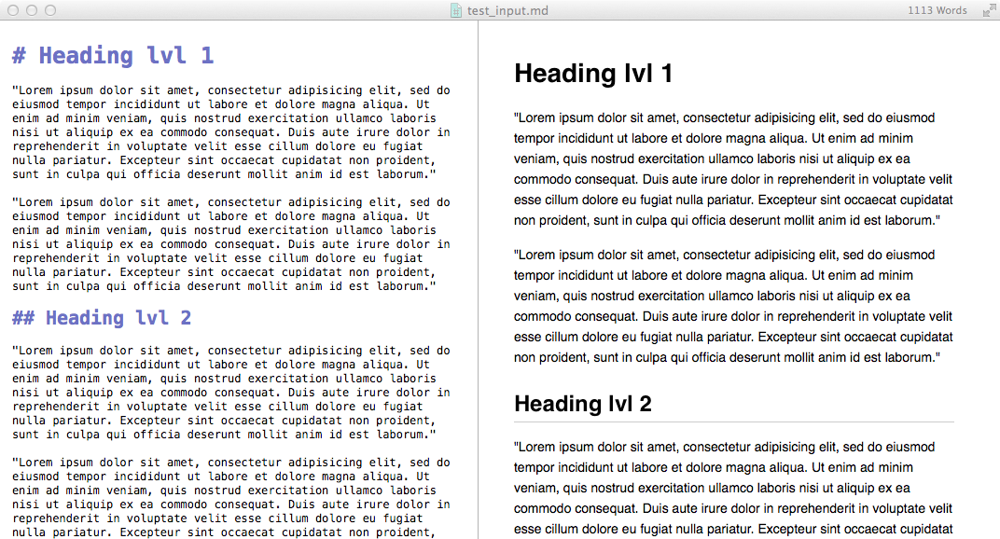

markdown-toclify
================

markdown_toclify.py is a Python command line script that adds a **Table of Contents** with internal section-links to Markdown documents.

- [Usage](#usage)
    - [Optional arguments](#optional-arguments)
- [Examples](#examples)
    - [Input file](#input-file)
    - [Simple output file](#simple-output-file)
    - [Output file with back-to-top links and vertical space](#output-file-with-back-to-top-links-and-vertical-space)

**Requires:**  

- [Python 2.7.x or 3.x](https://www.python.org/downloads/)
- [argparse](https://pypi.python.org/pypi/argparse)

# Usage
[[back to top](#markdown-toclify)]

The usage is quite simple, you just need to provide a Markdown-formatted input file and the modified Markdown contents will be printed to the standard output screen. 

	./markdown_toclify.py input.md
	
 

## Optional arguments
[[back to top](#markdown-toclify)]

<pre>positional arguments:
  input.md              path to the Markdown input file

optional arguments:
  -h, --help            show this help message and exit
  -o output.md, --output output.md
                        path to the Markdown output file
  -b, --back_to_top     add [back to top] links.
  -g, --github          omits id-anchor tags (recommended for GitHub)
  -s pixels, --spacer pixels
                        add horizontal space (in pixels) after the table of contents
  -n, --nolink          create the table of contents without internal links
  -v, --version         show program's version number and exit
</pre>

 
 

#Examples
[[back to top](#markdown-toclify)]

 
 

## Input file
[[back to top](#markdown-toclify)]

 
 

## Simple output file
[[back to top](#markdown-toclify)]

Command:

	./markdown_toclify.py input.md -o output.md

 

 
 

## Output file with back-to-top links and vertical space
[[back to top](#markdown-toclify)]

Command:

	./markdown_toclify.py input.md -o output.md -b -s 100
	
 

